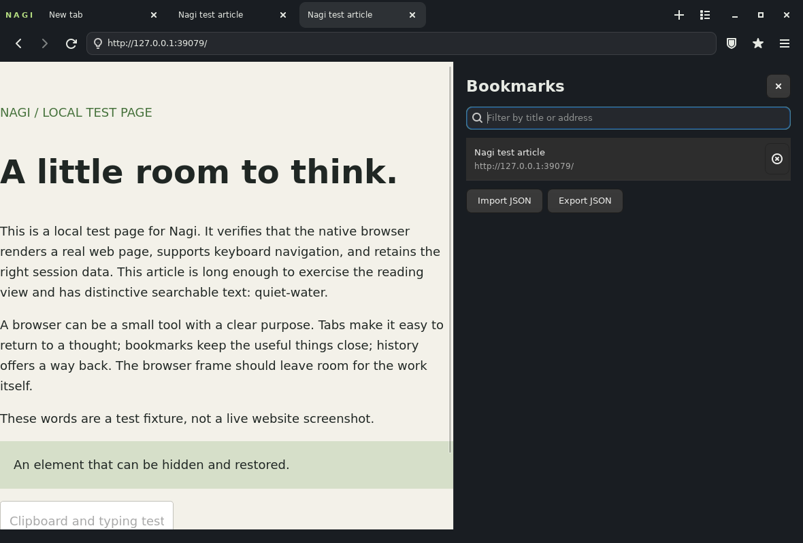

<div align="center">

# Nagi


**A little quieter on Omarchy.**

<a href="https://github.com/tcballard/omarchy-badges"></a>

</div>

Nagi is a desktop browser for Omarchy that keeps the page in focus. Browse with
native tabs, bookmarks and a reading view; keep your history and settings on
your own machine. It uses GTK4 and the system WebKitGTK engine, and follows
Omarchy's current colours. Inspired by [Search](https://github.com/driceroland/Search).

**Try v0.0.2 on x86_64 Omarchy / Arch:**

```sh
curl -fLO https://github.com/tcballard/nagi/releases/download/v0.0.2/nagi-0.0.2-1-x86_64.pkg.tar.zst
sudo pacman -U ./nagi-0.0.2-1-x86_64.pkg.tar.zst
nagi
```

**Preview pending:** an actual Omarchy/Hyprland screenshot will go in `preview.png`
after on-device testing. This [automated browser capture](docs/ci-browser.png)
shows a local test page on Ubuntu/Xvfb, with the bookmarks panel open.
[Verification](VERIFICATION.md) · [Build and configuration](#build-and-run-on-omarchy--arch) ·
[Keyboard shortcuts](#keyboard) · [Known limits](#status).



## Included

- Floating address/search panel with back/forward, reload/stop, protection and bookmarks.
- Tabs, pinned tabs, duplicate, mute, reopen closed tabs and a searchable tab list.
- Session restoration; background restored tabs load when selected.
- Private tabs with separate ephemeral website storage.
- Searchable local bookmarks/history; bookmark JSON import/export.
- Downloads with destination picker, progress, cancellation and folder opening.
- Find on page and plain-text reading view.
- Element hiding remembered per origin, with a restore control.
- Basic network-level blocking for 20 common third-party advertising/tracking domains.
- Per-site protection exceptions, camera/microphone/location/notification prompts,
  and confirmation before external-app links open.
- Live Omarchy theme updates, desktop launcher and URL handling.

## Status

Early preview, v0.0.2. See [VERIFICATION.md](VERIFICATION.md)
for the exact builds and runtime checks performed. Intended target: Omarchy 4
on Hyprland. Live acceptance on an Omarchy machine is still required.

This version does **not** include Chrome/Firefox extensions, a password vault,
passkey integration, synchronisation, a self-updater or guaranteed Widevine/DRM
playback. Reading view extracts text rather than reproducing article layouts.
The basic blocker is a small bundled list, not uBlock Origin or EasyList.

## Build and run on Omarchy / Arch

```sh
sudo pacman -S --needed rust pkgconf gtk4 webkitgtk-6.0 base-devel
git clone https://github.com/tcballard/nagi.git
cd nagi
cargo build --release --locked
./target/release/nagi
```

Rust stable is recommended; the committed lockfile pins Rust dependencies.
Native baseline: GTK 4.10+ and WebKitGTK 2.42+ API. For browsing, use an up-to-date
system WebKitGTK with security updates, not just the minimum API version.

Install the executable and desktop entry for your user:

```sh
./scripts/install-local.sh
```

Launch `Nagi` from the application launcher or run `~/.local/bin/nagi`.
It does not change your default browser or Hyprland shortcuts. To explicitly
make it the default after testing:

```sh
xdg-settings set default-web-browser io.github.tcballard.Nagi.desktop
```

For an Arch package built from this checkout:

```sh
./scripts/prepare-package.sh
cd dist
makepkg -si
```

The script creates a source archive from the committed revision and a PKGBUILD
with its actual SHA-256. Run makepkg as a regular user. No package is currently
claimed to be in the official Omarchy repository.

Ubuntu build dependencies: `libgtk-4-dev libwebkitgtk-6.0-dev pkg-config`
plus the Rust toolchain. Additional GStreamer codecs may be needed for video.

## Keyboard

| Action | Shortcut |
|---|---|
| Floating address / search | Super+Alt+L or Ctrl+L |
| Dismiss floating bar | Escape or click outside |
| New / close tab | Ctrl+T / Ctrl+W |
| Reopen closed tab | Ctrl+Shift+T |
| Private tab | Ctrl+Shift+N |
| Find a tab | Ctrl+K |
| Next / previous tab | Ctrl+Tab / Ctrl+Shift+Tab |
| Back / forward | Alt+Left / Alt+Right |
| Reload | Ctrl+R or F5 |
| Find on page | Ctrl+F |
| Bookmark page | Ctrl+D |
| Bookmarks / history / downloads | Ctrl+B / Ctrl+H / Ctrl+J |
| Reading view | Ctrl+Shift+R |
| Hide an element | Ctrl+Shift+H, then click |
| Zoom | Ctrl++ / Ctrl+- / Ctrl+0 |
| Settings | Ctrl+, |
| Fullscreen | F11 |

Omarchy's Super+W closes the window. Ctrl+W closes the current tab.

### Floating address bar (development branch)

The address bar opens in the centre of the browser over the current page. Press
**Super+Alt+L** or **Ctrl+L**, or click the search icon beside the tabs. Type an
address or search and press Enter. Escape or a click outside dismisses it and
returns focus to the page. New tabs open it automatically. Back/forward, reload,
site protection, bookmarks and the browser menu sit inside the floating panel.
These changes are not in the v0.0.2 download above; build this branch to try them.

Super shortcuts are subject to your compositor bindings. The Omarchy `dev`
bindings inspected at `b9ddccfc377abe0b8fc3ff1ee5b31a86bf202d4a` leave
Super+Alt+L unused; Super+L changes layout and Super+Ctrl+L locks the system.
Local custom bindings may differ. Ctrl+L always remains an app shortcut.

For an optional desktop-wide shortcut that also presents Nagi, the current
Omarchy Lua configuration accepts this in `~/.config/hypr/bindings.lua`:

```lua
o.bind("SUPER + ALT + L", "Nagi address / search", "nagi --focus-address")
```

Use an absolute executable path if `nagi` is not on your session PATH. This
command reuses Nagi's existing window, without adding a tab, or starts Nagi if
it is closed. Nagi does not install or overwrite any compositor binding. Older
Hyprland configurations using `.conf` instead of Lua require their own binding
syntax. This integration still needs a live Omarchy/Hyprland check.

## Data and privacy

- `~/.local/state/nagi/state.json`: settings, tabs, bookmarks, history and hidden selectors.
- `~/.local/share/nagi/web/`: cookies and website storage managed by WebKit.
- `~/.cache/nagi/`: engine and content-filter caches.

Standard absolute XDG overrides are respected. Local state uses a private
mode-0600 file and atomic replacement. Damaged or newer-format state is preserved;
Nagi displays a warning and does not overwrite it. There is no telemetry or sync.
Private tabs do not enter history or saved sessions. Explicit bookmarks and
downloads remain. Private browsing does not conceal traffic from websites or
your network. Downloads in progress are cancelled when the app closes.

Keep GTK/WebKit updated using your normal package manager. Nagi does not carry
its own engine updater or disable WebKit's security sandbox.

## Uninstall and rollback

For a user-local install:

```sh
./scripts/install-local.sh --uninstall
```

For an Arch package: `sudo pacman -R nagi`. Both preserve your browsing data.
To roll back, reinstall a previously built package using `sudo pacman -U <file>`
or rebuild the previous source revision. Back up the state directory before
changing versions. Restore your previous default browser using `xdg-settings`
if you chose to change it.

[Architecture](ARCHITECTURE.md) · [Credits](CREDITS.md) · [MIT licence](LICENSE)

[Approved icon and export rules](docs/icon-design.md)
