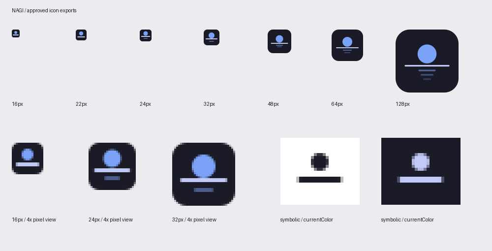

# Approved Nagi icon

The supplied master is preserved byte-for-byte at `assets/icons/hicolor/scalable/apps/nagi.svg`, including its embedded provenance metadata. SHA-256: `371c94d95297166de86e880c8aa9838236766d9c602d7e3ab2945171c6cc38b9`.

## Export rules

Run `python3 scripts/render-icons.py` with librsvg's `rsvg-convert` installed. It exports 16, 22, 24, 32, 48, 64, 128, 256 and 512px PNGs, plus the embedded internal-page favicon. Derived SVGs are kept under `assets/icons/variants/`.

16/22 use the 16-grid design (no reflections); 24/32 use the 32-grid design (one reflection); 48/64/96 use the 64-grid design (two reflections). Each small target is drawn on its own pixel grid with 2px strokes and integer line centres. The 24px moon is shifted up one pixel after visual testing found an overlap with the horizon. The 16-grid horizon endpoints are 3–13 so round caps respect the required 2px padding (the suggested 2.5–13.5 endpoints would give 1.5px). Tile corner radii remain exactly 22.5%.

128px and above are direct renders of the unchanged master. Its 4-unit strokes scale to 3.2, 6.4 and 12.8px, so antialiasing at their boundaries is unavoidable while preserving the approved geometry. The exact two-solid-row requirement is met at all six small export sizes. Circles, round caps and tile corners retain normal antialiasing.

The symbolic SVG uses only `currentColor`, with the exact supplied symbolic geometry. No tile or reflection is included. Light and dark foreground rendering was checked with librsvg. PNG corners are transparent; no colour profiles or extra effects are added by the exporter.

## Integration

The desktop file uses `Icon=nagi`; the GTK window requests the same name. Installers copy the scalable master, symbolic SVG and all nine PNG sizes into hicolor, and update an existing cache when available. Uninstall removes only Nagi's icon files. The old `io.github.tcballard.Nagi.svg` icon is removed on installation.

Internal native new tabs and reading-view tabs show the 16px family mark. The welcome page uses 64px; embedded images choose a larger asset when the GTK scale factor changes. Reading view includes a 16px PNG data favicon. The sources are embedded so these internal icons also work from a development build.

`python3 tests/icons.py` checks source identity, dimensions, transparency, reflection counts, corner ratios, separated moon/horizon geometry and fully covered horizon pixel rows. `tests/icon_lookup.py` checks all nine sizes through GTK's real hicolor lookup inside the GUI CI job. Normal package builds use committed PNGs and do not require a renderer.

## Platform acceptance

The build environment is Ubuntu 24.04, not an installed Omarchy system. Theme-aware icon syncing is therefore deliberately omitted; all artwork uses the approved static Tokyo Night palette. No theme hook or user configuration is installed. Real Omarchy launcher comparison against other installed browsers and Wayland window-icon display remain device acceptance checks. The icon ships in v0.0.2; the earlier v0.0.1 assets remain available unchanged.
